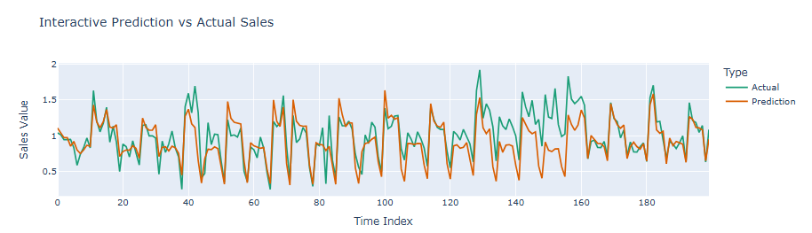
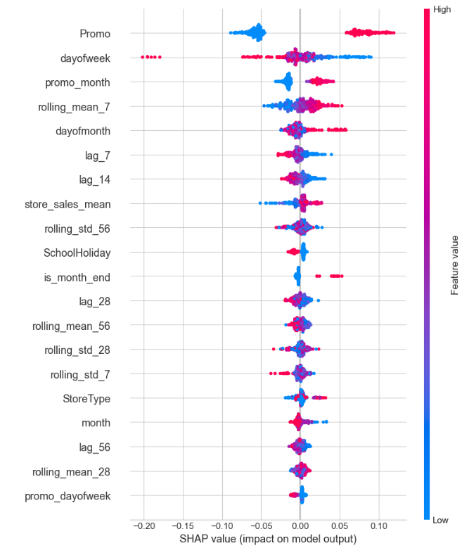
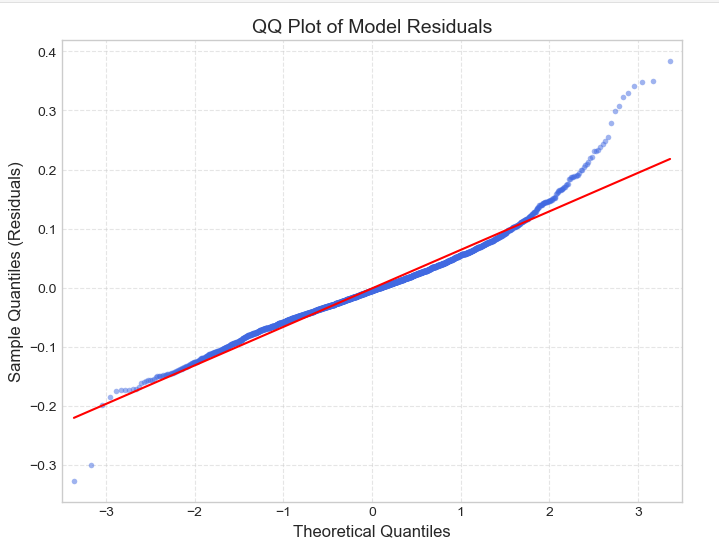

# Rossmann Store Sales Forecasting

End-to-end time series forecasting pipeline for 1,115 Rossmann drugstores across Germany — combining feature engineering, ensemble modeling, and SHAP-based interpretability to surface actionable business insights.

---

## Preview







---

# Key Results

| Model | RMSPE | Notes |
|---|---|---|
| Ridge Regression | ~0.164 | Linear baseline |
| Facebook Prophet | 0.29 – 1.8+ | Per-store, high variance |
| XGBoost | 0.143 | Best — store-level normalization + log transform |

**12.8% improvement over Ridge baseline**

---

# Repository Structure

```text
rossmann-forecasting/
├── TimeSeriAnalysis.ipynb   # Main notebook: EDA → Feature Eng → Modeling → SHAP
├── train.csv                # Raw training data (Kaggle)
├── test.csv                 # Raw test data (Kaggle)
├── store.csv                # Store metadata
├── df_merged.parquet        # Cleaned, merged, memory-optimized dataset
└── README.md
```

---

# Pipeline Overview

```text
Raw CSV (train + store)
        ↓
   Data Cleaning & Merging
   - Filter closed days (Open = 0)
   - Memory optimization (dtype casting)
   - Export → df_merged.parquet
        ↓
   Feature Engineering
   - Time features (cyclical encoding)
   - Lag features (lag_7, lag_14, lag_28, lag_365)
   - Rolling statistics (mean/std, 7–56 days)
   - Holiday proximity (DaysBeforeHoliday, DaysAfterHoliday)
   - Promo interaction features
        ↓
   Modeling
   - Ridge Regression (baseline)
   - Facebook Prophet (per-store trend analysis)
   - XGBoost (main model)
        ↓
   Interpretability & Evaluation
   - SHAP Summary Plot
   - Residual Analysis + QQ Plot
   - Interactive Plotly visualization
```

---

# Feature Engineering

## Time Features

| Feature | Description |
|---|---|
| DayOfWeek_sin/cos | Cyclical encoding — preserves circular nature of weekdays |
| Month_sin/cos | Cyclical encoding for months |
| IsWeekend, IsMonthStart, IsMonthEnd | Binary boundary flags |
| DaysBeforeHoliday, DaysAfterHoliday | Distance to nearest state holiday |

---

## Lag & Rolling Features

| Feature | Description |
|---|---|
| lag_7 / 14 / 28 / 365 | Historical sales intervals |
| rolling_mean_7/28/56 | Trend signals |
| rolling_std_7/28/56 | Volatility signals |
| Sales_ExpandingMean | Store-level baseline (cumulative average) |

---

## Interaction Features

| Feature | Description |
|---|---|
| promo_month | Promotion × month interaction |
| promo_weekend | Promotion × weekend interaction |
| store_sales_mean | Per-store normalization |
| competition_near | Nearby competitor flag |

---

# Modeling

## Ridge Regression — Baseline

Linear model with L2 regularization.  
Serves as a stable baseline and sanity check for feature validity.

- RMSPE: ~0.164
- Stable train/validation gap

---

## Facebook Prophet — Trend Decomposition

Applied per-store for interpretability rather than raw accuracy.

Captures:
- Trend
- Weekly seasonality
- Promotion effects

However, performance variance across stores is high:

- RMSPE: 0.29 – 1.8+

---

## XGBoost — Main Model

```python
XGBRegressor(
    n_estimators=2000,
    learning_rate=0.03,
    max_depth=8,
    min_child_weight=10,
    subsample=0.8,
    colsample_bytree=0.8,
    objective="reg:squarederror"
)
```

### Store-level Target Normalization

```python
df["sales_norm"] = df["Sales"] / df["store_sales_mean"]
df["sales_norm_log"] = np.log1p(df["sales_norm"])
```

Normalizing by each store's average sales before log-transform reduces inter-store variance and stabilizes the target distribution.

Result:

- RMSPE improved from **0.149 → 0.143**

---

# SHAP Interpretability


## Business Insights

### 1. Promo — The #1 Sales Driver

SHAP values show a strong, clean split: days with active promotions (high feature value) cluster heavily on the positive side, while non-promo days drag sales below average. Promotion timing has the highest ROI for intervention of any controllable variable in the dataset.

---

### 2. DayOfWeek — Hidden Complexity

Ranked #2 by mean |SHAP|, but with surprising distribution: high day-of-week values (Friday, Saturday, Sunday) appear both far-right and far-left on the SHAP axis. This reveals a subset of stores that close on Sundays — pulling those days to strong negative SHAP values despite a "high" weekday number. Segment-level analysis per store type is needed before acting on this signal.

---

### 3. Short-term Momentum (rolling_mean_7, lag_7/14)

Lag and rolling features contribute consistently positive SHAP values when recent sales are high. The model has learned that sales momentum carries forward week-over-week — making these features reliable inputs for near-term forecasting horizons.

---

### 4. Promo × Time Interaction

Month-end and promo-month features show directional SHAP values aligned with intuition: falling in a promotion month or at month-end adds positive expected lift. This confirms that promo scheduling at month boundaries amplifies impact.
---

### 5. Low-signal Features

'StoreType', 'SchoolHoliday', and 'CompetitionDistance' show near-zero SHAP values with scattered distributions — the model largely ignores these for prediction. Their importance may be captured indirectly through lag and rolling features.

---

# 📉 Residual Analysis


## QQ Plot Findings

### Mid-range Quantiles

Points track the diagonal tightly — the model forecasts normal sales days with high accuracy and well-distributed errors.

---

### Right Tail

Points diverge sharply upward — the model under-predicts sales spikes. On exceptional revenue days, the log-transform and lack of spike-specific features cause the model to be overly conservative.
---

### Left Tail

Slight downward drift — minor over-prediction on extremely slow days, much smaller in magnitude than right-tail errors.
---

## Key Implication

XGBoost performs well on typical trading days but misses Black Friday-style peaks. A spike detector or hybrid ensemble could address this in future iterations.
---

# 🏁 Model Comparison Summary

| Dimension | Ridge | Prophet | XGBoost |
|---|---|---|---|
| Forecast Accuracy | ⭐⭐⭐ | ⭐⭐ | ⭐⭐⭐⭐⭐ |
| Interpretability | ⭐⭐ | ⭐⭐⭐⭐⭐ | ⭐⭐⭐⭐ |
| Stability | ⭐⭐⭐⭐ | ⭐⭐ | ⭐⭐⭐⭐ |
| Use Case | Baseline | Behavior Analysis | Production Forecasting |

No single model dominates all dimensions. Ridge provides a reliable reference point. Prophet excels at decomposing and explaining seasonal behavior. XGBoost is the clear choice for production forecasting accuracy.

---

# How to Run

## 1. Install Dependencies

```bash
pip install pandas numpy scikit-learn xgboost prophet shap plotly matplotlib seaborn pyarrow statsmodels
```

---

## 2. Download Dataset

Download dataset from:

- Kaggle — Rossmann Store Sales

Place:
- `train.csv`
- `test.csv`
- `store.csv`

inside the project root.

---

## 3. Run Notebook

```bash
jupyter lab TimeSeriAnalysis.ipynb
```

Run all cells sequentially.

The notebook automatically generates:

```text
df_merged.parquet
```

during preprocessing.

---

---

# Future Improvements

- Spike modeling using external event calendars
- LightGBM / CatBoost benchmarking
- Store clustering before modeling
- Probabilistic forecasting with confidence intervals

---

# Dataset

**Rossmann Store Sales — Kaggle Competition**

- 1,017,209 training records
- 1,115 stores
- January 2013 – July 2015
